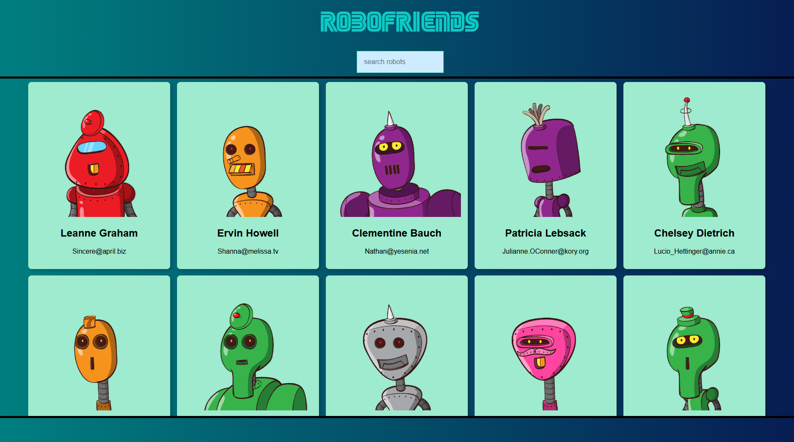

## Robo-Friends

A front-end website using React and Redux that displays user profiles in the form of card React components and dynamically filters the profiles by typing in the search field.

Uses the JSONPlaceholder for user information and the RoboHash API for the robot images for each profile. Click [here](https://haipa-robofriends.herokuapp.com/) to try out the website.

## Technologies Used
* React
* Redux
* React-Redux
* Redux-Thunk
* Redux-Logger
* JSON Placeholder
* RoboHash API
* React-Redux
* Tachyons for styling

